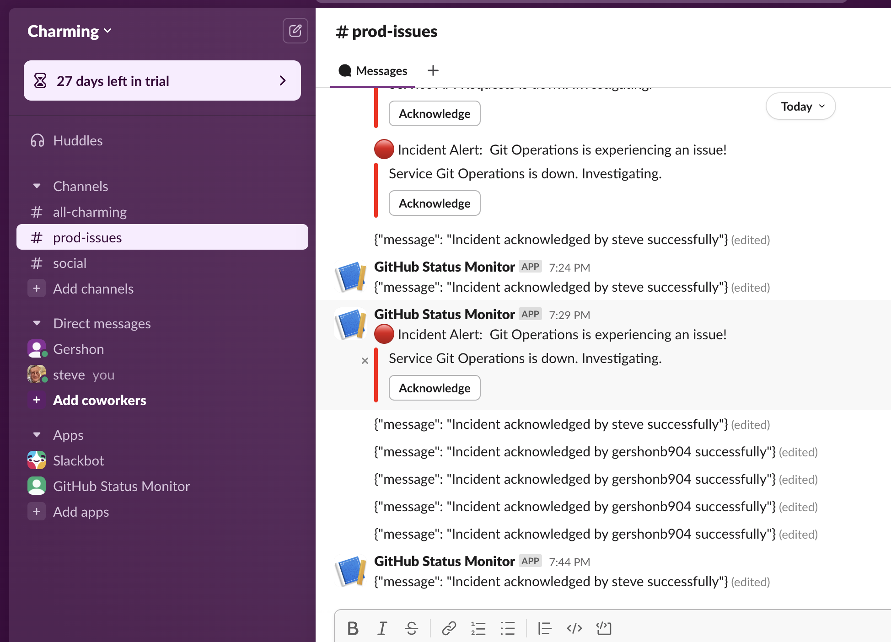

# GitHub Status Monitoring Solution
A solution for monitoring GitHub's service status, providing outage notifications and incident management through Slack, with high availability across multiple AWS regions.

## Overview

This solution monitors GitHub's service status (Git Operations and API Requests) and sends notifications to Slack when outages occur. It includes an acknowledgment mechanism.



### Solution Components
1. **Outage Notification**
   - Monitors GitHub service status
   - Sends alerts to Slack channel
   - Includes incident details and acknowledgment button

2. **Incident Acknowledgment**
   - Interactive Slack buttons for immediate acknowledgment
   - Records who acknowledged the incident
   - Updates incident status in real-time

## Prerequisites

-   AWS CLI configured with appropriate permissions
-   Terraform v1.0.0+
-   Python 3.8+
-   Slack workspace with webhook configured
-   StatusCake account (free tier)

### High Availability Architecture
- Multi-region deployment of Lambda functions (us-east-1 primary, us-west-2 secondary)
- API Gateway with failover using HTTP API v1
- DynamoDB with cross-region replication
- Automatic failover through API Gateway if primary region is unavailable

## Getting Started

### 1. Clone the Repository

```bash
git clone https://github.com/CharmingSteve/cyberark-github-status-monitor.git
cd cyberark-github-status-monitor
```

### 2. Slack Webhook Setup Instructions

1.  Go to <https://api.slack.com/apps> and click "Create New App"
2.  Choose "From scratch" and name your app "GitHub Status Monitor"
3.  Select your workspace and click "Create App"
4.  In the app settings, click on "Incoming Webhooks" in the left sidebar
5.  Toggle "Activate Incoming Webhooks" to On
6.  Click "Add New Webhook to Workspace"
7.  Select your alerts channel and click "Allow"
8.  Copy the webhook URL - this will be used in your Terraform configuration
9.  **Important Note**: After initial installation, you'll only see a "Reinstall to Workspace" option for adding additional webhooks. When you use this option, the newest webhook will appear at the bottom of the list, even though they all show the same creation date. Always use the webhook URL at the bottom of the list as it's the most recently created one.

### 3. StatusCake Setup (Backup Monitoring) - Not implimented - but can be added via terraform to have another layer of HA

1.  Create a StatusCake Account:

    -   Sign up for a free StatusCake account at <https://www.statuscake.com/>
    -   The free tier is sufficient for our backup monitoring needs
2.  Configure Webhook for Slack Integration:

    -   In StatusCake, go to "Contact Groups"
    -   Click "Add New Contact Group"
    -   Name it "GitHub Status Alerts"
    -   Under "Add Contact Method", select "WebHook"
    -   Enter your Slack webhook URL (the same one from step 2)
    -   Save the contact group
3.  Create an Uptime Test:

    -   Click "Add New Test" or "Create Test"
    -   Select "Uptime Test" as the test type
    -   Enter these settings:
        -   Test Name: GitHub Status Monitor
        -   Website URL: <https://www.githubstatus.com/api/v2/summary.json>
        -   Check Rate: 5 minutes (or lowest available on free tier)
        -   Test Type: HTTP
        -   Under "Alert Settings", select the contact group you created
        -   Save the test
4.  Get API Credentials:

    -   Go to Account → API Keys
    -   Generate a new API key if one doesn't exist
    -   Copy this key for use in our Terraform configuration

### 4. S3 Bucket Setup for Terraform State

1.  Create the S3 Bucket:

    ```bash
    aws s3api create-bucket \
    --bucket cyberark-github-status-monitor \
    --region us-east-1
    ```
2.  Enable Versioning:

    ```bash
    aws s3api put-bucket-versioning \
    --bucket cyberark-github-status-monitor \
    --versioning-configuration Status=Enabled
    ```
3.  Enable Default Encryption:

    ```bash
    aws s3api put-bucket-encryption \
    --bucket cyberark-github-status-monitor \
    --server-side-encryption-configuration '{ "Rules": [ { "ApplyServerSideEncryptionByDefault": { "SSEAlgorithm": "AES256" } } ] }'
    ```
4.  Block Public Access:

    ```bash
    aws s3api put-public-access-block \
    --bucket cyberark-github-status-monitor \
    --public-access-block-configuration '{ "BlockPublicAcls": true, "IgnorePublicAcls": true, "BlockPublicPolicy": true, "RestrictPublicBuckets": true }'
    ```
5.  Create a Bucket Policy (Optional but recommended)

    Create a file named `bucket-policy.json` with the following content:

    ```json
    {
      "Version": "2012-10-17",
      "Statement": [
        {
          "Effect": "Allow",
          "Principal": {
            "AWS": "arn:aws:iam::YOUR_ACCOUNT_ID:user/YOUR_USERNAME"
          },
          "Action": [
            "s3:GetObject",
            "s3:PutObject",
            "s3:ListBucket"
          ],
          "Resource": [
            "arn:aws:s3:::cyberark-github-status-monitor",
            "arn:aws:s3:::cyberark-github-status-monitor/*"
          ]
        }
      ]
    }
    ```

    Then apply the policy:

    ```bash
    aws s3api put-bucket-policy \
    --bucket cyberark-github-status-monitor \
    --policy file://bucket-policy.json
    ```
6.  Configure Terraform Backend:

    -   Edit `terraform/backend.tf` and update the bucket name to match your S3 bucket
    -   Ensure the region matches your AWS region
    -   Run `terraform init` to initialize the backend

### 5. Secret Management Setup

1.  GitHub Secrets Configuration:

    -   Go to your GitHub repository → Settings → Secrets and variables → Actions
    -   Add the following secrets:
        -   `AWS_ACCESS_KEY_ID`: Your AWS access key
        -   `AWS_SECRET_ACCESS_KEY`: Your AWS secret key
        -   `SLACK_API_TOKEN`: Your Bot User OAuth Token (starts with `xoxb-`)
        -   `SLACK_WEBHOOK_URL`: Your Slack webhook URL
        -   `STATUSCAKE_API_KEY`: Your StatusCake API key

2.  Terraform Variables:

    -   Update `terraform/variables.tf` with appropriate default values
    -   Sensitive values will be pulled from GitHub Secrets during deployment

### Github Actions CI/CD Pipeline

The solution includes a GitHub Actions workflow for automated deployments:
- Terraform validation
- Infrastructure deployment

For details, see [.github/workflows/terraform.yml](.github/workflows/terraform.yml)


### 6. Infrastructure Deployment - You can also run the pipeline from you local laptop with terraform
1.  To run from GitHub Actions, make sure to have AWS CLI setup with credentials that can do everything. Set env vars that you otherwise would put as pipeline secrets:

    ```bash
    export TF_VAR_slack_api_token="YOURSECRETTOKEN"
    export TF_VAR_slack_webhook_url="https://hooks.slack.com/services/THEWHOLESECRETLINK"
    ```


2.  to run from your laptop - Initialize Terraform:

    ```bash
    cd terraform
    terraform init
    ```
3.  Review the deployment plan:

    ```bash
    terraform plan
    ```
4.  Apply the configuration:

    ```bash
    terraform apply
    ```

    This will deploy:

    -   Lambda functions in two AWS regions
    -   DynamoDB Global Tables for state tracking
    -   API Gateway for Slack interactions
    -   StatusCake integration via the Terraform provider - not implimentefd

### 7. Testing the Solution

### API Gateway Acknowledgment Endpoint
The acknowledgment endpoint is available through API Gateway. The URL can be found in terraform outputs:
```bash
terraform output acknowledgment_api_gateway_url
curl -X POST "$(terraform output -raw acknowledgment_api_gateway_url)" \
  -H "Content-Type: application/json" \
  -d '{"incident_id": "test-incident-123", "user": {"id": "U123", "name": "testuser"}}'
```

## Architecture

This solution uses a multi-layered approach to ensure high availability:

1.  **Primary Monitoring**: AWS Lambda functions deployed in multiple regions (us-east-1 and us-west-2) check GitHub's status API every 5 minutes and send alerts to Slack.
2.  **State Management**: DynamoDB Global Tables replicated across regions store the current status and acknowledgment information.
3.  **Backup Monitoring**: StatusCake provides an independent monitoring system that sends alerts directly to Slack using the same webhook URL, ensuring notifications even if AWS experiences a multi-region outage.
4.  **Acknowledgment System**: When someone acknowledges an incident in Slack, their name is recorded in DynamoDB and a follow-up message is sent to the channel.
5.  **Escalation System**: If no one acknowledges an incident within 15 minutes, an escalation notification is sent to ensure critical issues are addressed.

## CI/CD Pipeline

The included GitHub Actions workflows automate testing and deployment:

1.  **Testing Workflow**: Runs on pull requests to validate changes
2.  **Deployment Workflow**: Runs on merges to main branch to deploy infrastructure
3.  **Security Scanning**: Checks for sensitive information and security vulnerabilities

## Infrastructure State Management

This project uses an S3 bucket for Terraform state management with native S3 locking (without DynamoDB).

### Why No DynamoDB for Terraform State?

1.  Single-User Test Environment:

    -   This implementation is for a test/demo environment with a single operator
    -   No risk of concurrent modifications that would require distributed locking
2.  Terraform v1.10+ Support:

    -   Recent Terraform versions support native S3 locking without DynamoDB
    -   The `use_lockfile = true` setting enables this functionality

## Slack API Setup for Terraform

To use Terraform for automating your Slack configuration, you'll need to obtain a Slack API token:

### Getting a Slack API Token

1.  Go to <https://api.slack.com/apps> and click "Create New App"
2.  Choose "From scratch" and name your app "GitHub Status Monitor"
3.  Select your workspace and click "Create App"
4.  In the left sidebar, click on "OAuth &amp; Permissions"
5.  Scroll down to "Scopes" and add the following Bot Token Scopes:

    -   `chat:write` (to send messages)
    -   `incoming-webhook` (to create and use webhooks)
6.  Scroll back up and click "Install to Workspace"
7.  After authorizing, you'll be provided with a Bot User OAuth Token that starts with `xoxb-`
8.  Copy this token - you'll use it in your Terraform configuration

### Setting Up Webhook

1.  While still in the OAuth &amp; Permissions page, scroll down to "Incoming Webhooks"
2.  Toggle "Activate Incoming Webhooks" to On
3.  Click "Add New Webhook to Workspace"
4.  Select your alerts channel and click "Allow"
5.  Copy the webhook URL - this will be used in your StatusCake configuration
6.  **Important Note**: After initial installation, you'll only see a "Reinstall to Workspace" option for adding additional webhooks. When you use this option, the newest webhook will appear at the bottom of the list, even though they all show the same creation date. Always use the webhook URL at the bottom of the list as it's the most recently created one.

### Slack App Configuration
After deploying the infrastructure, you must manually configure the Slack app:

1. Go to [Slack API Apps](https://api.slack.com/apps)
2. Select your app
3. Navigate to "Interactivity & Shortcuts"
4. Enable "Interactivity"
5. Set Request URL to your API Gateway endpoint:
   ```
   https://[API_ID].execute-api.[REGION].amazonaws.com/prod/acknowledge
   ```
6. Save Changes

This step is required for the acknowledgment buttons to work.

### Security Considerations

While we've simplified the Terraform state architecture, we maintain strong security practices:

1.  S3 Bucket Encryption: All state files are encrypted at rest using AES-256
2.  Versioning: Bucket versioning is enabled to prevent accidental state loss
3.  Secure Credentials: All AWS credentials, Slack webhook URLs, and StatusCake API keys are stored as GitHub Secrets
4.  Least Privilege: IAM roles follow the principle of least privilege

### Enterprise Considerations

In an enterprise environment, CyberArk Conjur could replace GitHub Secrets for enhanced security. CyberArk provides a dedicated GitHub Action (CyberArk Conjur Secret Fetcher) for secure secrets delivery, centralizing secrets management and providing advanced auditing capabilities.

## Production Considerations

For a production deployment, consider:

1.  Adding DynamoDB for Terraform state locking in team environments
2.  Implementing additional access controls and audit logging
3.  Setting up state file backup procedures
4.  Using CyberArk Conjur for enterprise-grade secrets management
5.  Configuring additional notification channels beyond Slack
6.  Implementing more sophisticated escalation procedures
